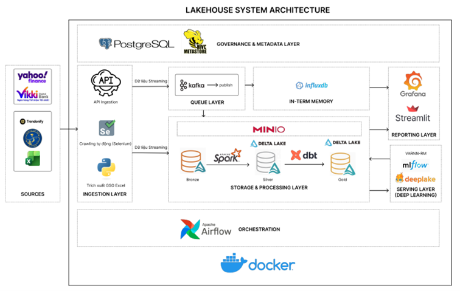
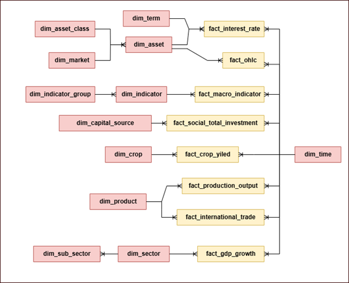
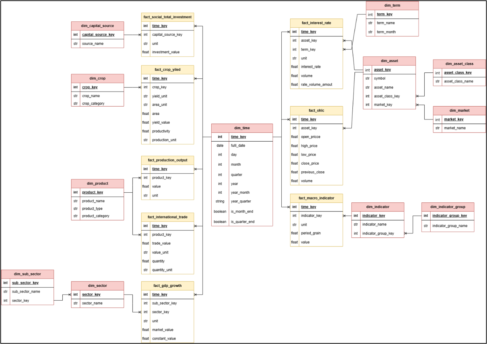
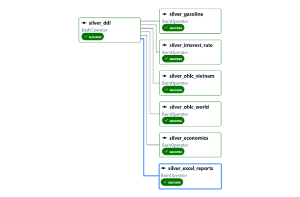
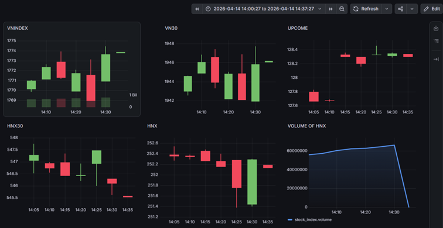
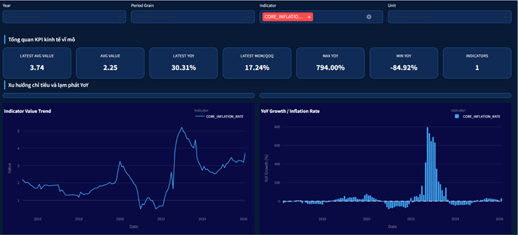
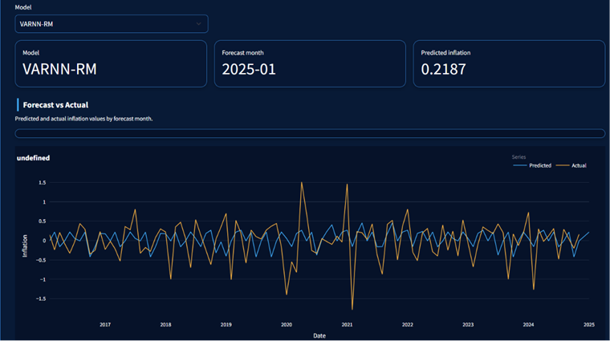

# Vietnam Economic Lakehouse

Dự án xây dựng một Data Lakehouse phục vụ phân tích kinh tế Việt Nam - thu thập dữ liệu đa nguồn, lưu trữ theo kiến trúc Medallion trên MinIO, xử lý bằng Apache Spark và dbt, điều phối bởi Airflow, hỗ trợ near‑real‑time với Kafka → InfluxDB → Grafana, và quản lý mô hình bằng MLflow.
## Tập dữ liệu

| STT | Nguồn dữ liệu | Nhóm dữ liệu | Dữ liệu chính | Phạm vi | Tần suất |
|---:|---|---|---|---|---|
| 1 | Cục Thống kê - Bộ Tài chính | Kinh tế - xã hội | GDP | 03/2011–06/2026 | Quý |
| 2 | Cục Thống kê - Bộ Tài chính | Kinh tế - xã hội | Vốn đầu tư toàn xã hội | 03/2011–06/2026 | Quý |
| 3 | Cục Thống kê - Bộ Tài chính | Thương mại | Xuất khẩu, nhập khẩu | 01/2011–06/2026 | Tháng |
| 4 | Cục Thống kê - Bộ Tài chính | Nông nghiệp | Lâm nghiệp, chăn nuôi, thủy sản | 03/2011–06/2026 | Quý |
| 5 | Cục Thống kê - Bộ Tài chính | Công nghiệp | Sản phẩm công nghiệp | 01/2011–06/2026 | Tháng |
| 6 | Cục Thống kê - Bộ Tài chính | Nông nghiệp | Cây trồng hàng năm, lâu năm | 12/2011–12/2025 | Năm |
| 7 | Cục Thống kê - Bộ Tài chính | Giá cả | CPI Việt Nam | 1995–2024 | Tháng |
| 8 | Trendonify | Giá cả | Lạm phát cơ bản | 2015–2026 | Tháng |
| 9 | Trendonify | Giá cả | PPI | 2011–2026 | Quý |
| 10 | ADB ARIC | Tiền tệ | Broad Money to Reserves, Policy Rate | 1995–2026 | Tháng |
| 11 | Ngân hàng Nhà nước Việt Nam | Tiền tệ | Lãi suất liên ngân hàng | 04/2014–06/2026 | Ngày |
| 12 | Yahoo Finance API | Tỷ giá | USD/VND, CNY/VND, JPY/VND, EUR/VND | 1996–2026 | Ngày / 1 phút |
| 13 | Yahoo Finance API | Hàng hóa | Dầu Brent, WTI, xăng, khí tự nhiên, vàng, bạc | Lịch sử–2026 | Ngày / 1 phút |
| 14 | Yahoo Finance API | Chứng khoán quốc tế | S&P 500, Dow Jones, Nasdaq, Nikkei 225, Hang Seng, DAX | Lịch sử–2026 | Ngày / 1 phút |
| 15 | Investing | Chứng khoán Việt Nam | VN-Index, VN30, HNX, HNX30, UPCOM | 2000–2026 | Ngày |
| 16 | Vikkibanks | Chứng khoán Việt Nam | VN-Index, VN30, HNX, HNX30, UPCOM | 2026 | Ngày / 1 phút |

## Kiến trúc hệ thống

## Công nghệ sử dụng 
| STT | Công nghệ                        | Vai trò chính                               |
| --: | -------------------------------- | ------------------------------------------- |
|   1 | **Apache Spark**                 | Xử lý và biến đổi dữ liệu, ETL              |
|   2 | **MinIO**                        | Lưu trữ dữ liệu Lakehouse                   |
|   3 | **Apache Kafka**                 | Thu thập và truyền tải dữ liệu realtime     |
|   4 | **InfluxDB**                     | Lưu trữ dữ liệu chuỗi thời gian realtime    |
|   5 | **Delta Lake**                   | Định dạng lưu trữ cho Silver/Gold Layer     |
|   6 | **dbt**                          | Biến đổi, mô hình hóa và xây dựng Data Mart |
|   7 | **Streamlit**                    | Xây dựng dashboard phân tích tương tác      |
|   8 | **Deep Lake**                    | Quản lý dữ liệu phục vụ AI/ML               |
|   9 | **Grafana**                      | Trực quan hóa dữ liệu realtime              |
|  10 | **Apache Airflow**               | Điều phối và tự động hóa pipeline           |
|  11 | **Apache Hive / Hive Metastore** | Quản lý metadata của Lakehouse              |
|  12 | **PostgreSQL**                   | Lưu trữ metadata và trạng thái hệ thống     |
|  13 | **MLflow**                       | Tracking, quản lý và đăng ký mô hình ML     |
|  14 | **Docker**                       | Container hóa và triển khai hệ thống        |
## Mô hình dữ liệu tầng Gold

## Kết quả 
- Thiết kế và triển khai Kiến trúc Lakehouse hoàn chỉnh (Ingestion, Storage, Processing, Orchestration, Serving, ML).
- Lưu trữ theo kiến trúc 3 tầng Medallion (Bronze/Silver/Gold) trên MinIO.
- Pipelines batch và ETL bằng Apache Spark; mô hình hóa lớp Gold bằng dbt.
- Điều phối và giám sát pipeline bằng Apache Airflow.

- Pipeline near‑real‑time cho dữ liệu thị trường (Kafka → InfluxDB → Grafana).

- Dashboard phân tích (GDP, nông nghiệp, thương mại, thị trường, lạm phát) và pipeline dự báo lạm phát.

- MLflow tích hợp cho tracking, artifact và quản lý mô hình.
- Kết quả thực nghiệm mô hình:

| Nhóm mô hình | Mô hình | RMSE | MAE |
|---|---|---:|---:|
| Mô hình lai học sâu đa biến | **VARNN-RM** | **0.427859** | **0.323549** |
| Mô hình học máy | Random Forest | 0.486811 | 0.375148 |
| | XGBoost | 0.521813 | 0.404909 |
| Mô hình học sâu | TCN | 0.428792 | 0.344686 |
| | LSTM | 0.439326 | 0.364505 |
| | RNN | 0.443045 | 0.345748 |
| | GRU | 0.534187 | 0.414268 |
| Mô hình thống kê chuỗi thời gian | SARIMAX | 1.239439 | 0.897255 |
## Dashboard dự báo lạm phát

## Hạn chế
- Dữ liệu đầu vào chưa đồng nhất (Excel nhiều sheet, định dạng khác nhau).
- Quan sát lịch sử vĩ mô còn hạn chế cho một số mô hình học sâu.
- Triển khai hiện tại trên Docker Compose — chưa production‑ready.

## Hướng phát triển
- Chuẩn hóa và mở rộng nguồn dữ liệu (thêm dữ liệu phi cấu trúc).
- Triển khai trên Kubernetes hoặc cloud để tăng khả năng mở rộng và vận hành.
- Cải tiến mô hình dự báo, thêm cơ chế giải thích (explainability) và hoàn thiện quy trình MLOps.

---
## Tài liệu tham khảo
- [Apache Spark](https://spark.apache.org/)

- [200Lab – What Is DBT?](https://200lab.io/)
- [Apache Kafka – Distributed Event Streaming Platform](https://kafka.apache.org/)
- [Apache Hive](https://hive.apache.org/)
- [AtScale – What Is Data Fabric?](https://www.atscale.com/)
- [AWS – Kiến trúc dữ liệu là gì?](https://aws.amazon.com/)
- [Bai, Kolter & Koltun – An Empirical Evaluation of Generic Convolutional and Recurrent Networks for Sequence Modeling](https://arxiv.org/abs/1803.01271)
- [Box et al. – Time Series Analysis: Forecasting and Control](https://www.wiley.com/)
- [Breiman – Random Forests](https://doi.org/10.1023/A:1010933404324)
- [Brockwell & Davis – Introduction to Time Series and Forecasting](https://link.springer.com/)
- [Chen & Guestrin – XGBoost: A Scalable Tree Boosting System](https://doi.org/10.1145/2939672.2939785)
- [Cho et al. – Learning Phrase Representations Using RNN Encoder–Decoder](https://aclanthology.org/D14-1179/)
- [Coursera – Relational Database](https://www.coursera.org/)
- [DataCamp – Apache Spark Architecture](https://www.datacamp.com/)
- [DataCamp – Getting Started with Apache Airflow](https://www.datacamp.com/)
- [DataCamp – What Is a Data Lakehouse?](https://www.datacamp.com/)
- [DataCamp – What Is dbt?](https://www.datacamp.com/)
- [Databricks – Data Quality and Observability in Lakehouse Pipelines](https://www.databricks.com/)
- [Databricks – The Modern Data Warehouse](https://www.databricks.com/)
- [Databricks – What Is a Data Mesh?](https://www.databricks.com/)
- [Delta Lake Documentation](https://docs.delta.io/)
- [Docker Documentation](https://docs.docker.com/)
- [FoxAI – Data Lakehouse là gì?](https://fox.ai.vn/)
- [GeeksforGeeks – Gated Recurrent Unit Networks](https://www.geeksforgeeks.org/machine-learning/gated-recurrent-unit-networks/)
- [GeeksforGeeks – Jaccard Similarity](https://www.geeksforgeeks.org/)
- [GeeksforGeeks – Long Short-Term Memory](https://www.geeksforgeeks.org/deep-learning/deep-learning-introduction-to-long-short-term-memory/)
- [GeeksforGeeks – Recurrent Neural Networks](https://www.geeksforgeeks.org/machine-learning/introduction-to-recurrent-neural-network/)
- [GeeksforGeeks – What Is Data Ingestion?](https://www.geeksforgeeks.org/)
- [Google Cloud – Data Pipeline Monitoring Best Practices](https://cloud.google.com/)
- [Grafana Documentation](https://grafana.com/docs/)
- [Grafana – InfluxDB Data Source](https://grafana.com/docs/grafana/latest/datasources/influxdb/)
- [Gharwi & Shu – Variability Aware Recursive Neural Network (VARNN)](https://arxiv.org/abs/2510.08944)
- [Gridin – Time Series Forecasting using Deep Learning](https://www.bpbpublications.com/)
- [Deep Lake – A Lakehouse for Deep Learning](https://arxiv.org/abs/2209.10785)
- [Hochreiter & Schmidhuber – Long Short-Term Memory](https://doi.org/10.1162/neco.1997.9.8.1735)
- [Hyndman & Athanasopoulos – Forecasting: Principles and Practice](https://otexts.com/fpp3/)
- [IBM – What Is a Data Lakehouse?](https://www.ibm.com/think/topics/data-lakehouse)
- [IBM – What Is Data Storage?](https://www.ibm.com/)
- [IMF – Consumer Price Index (CPI)](https://data.imf.org/en/datasets/IMF.STA:CPI)
- [InfluxDB Documentation](https://docs.influxdata.com/)
- [insightsoftware – Data Source Types](https://insightsoftware.com/)
- [Báo Chính phủ](https://baochinhphu.vn/)
- [Bui – Inflation and Stock Index: Evidence from Vietnam](https://www.abacademies.org/articles/inflation-and-stock-index-evidence-from-vietnam-8725.html)
- [Do & Le – Effects of Macroeconomic Factors on Stock Market Development](https://www.multiresearchjournal.com/)
- [Lässig – Temporal Convolutional Networks and Forecasting](https://unit8.com/resources/temporal-convolutional-networks-and-forecasting/)
- [Delta Lake: The Definitive Guide](https://www.oreilly.com/)
- [Lütkepohl – New Introduction to Multiple Time Series Analysis](https://link.springer.com/)
- [Manning, Raghavan & Schütze – Introduction to Information Retrieval](https://nlp.stanford.edu/IR-book/)
- [Microsoft Azure – What Is a Data Lake?](https://azure.microsoft.com/en-us/resources/cloud-computing-dictionary/what-is-a-data-lake)
- [Mikolov et al. – Efficient Estimation of Word Representations in Vector Space](https://arxiv.org/abs/1301.3781)
- [PostgreSQL](https://www.postgresql.org/)
- [Russell & Norvig – Artificial Intelligence: A Modern Approach](https://aima.cs.berkeley.edu/)
- [scikit-learn – Lagged Features for Time Series Forecasting](https://scikit-learn.org/)
- [statsmodels – SARIMAX Documentation](https://www.statsmodels.org/)
- [Trino](https://trino.io/)
- [TutorialsPoint – Relational Data Warehouse](https://www.tutorialspoint.com/)
- [Wikipedia – Data Build Tool](https://en.wikipedia.org/wiki/Data_build_tool)
